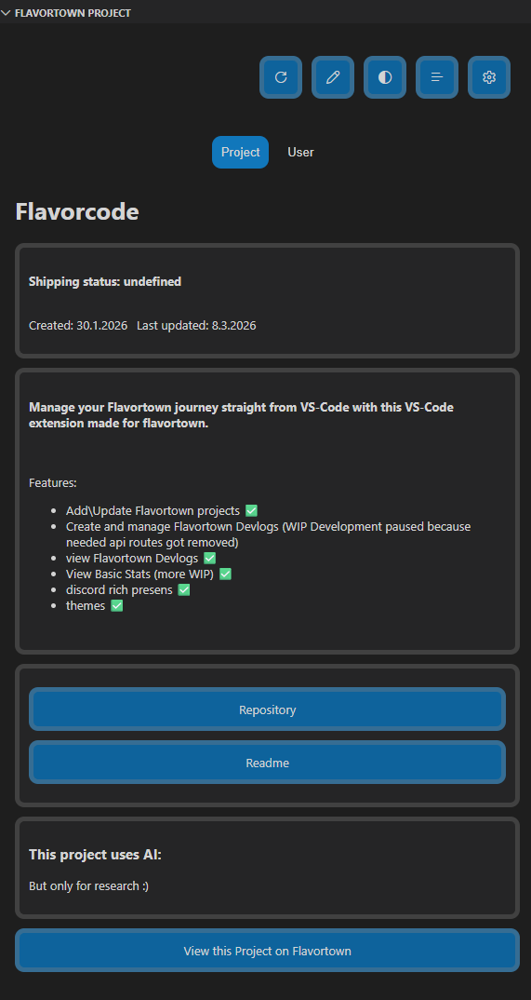
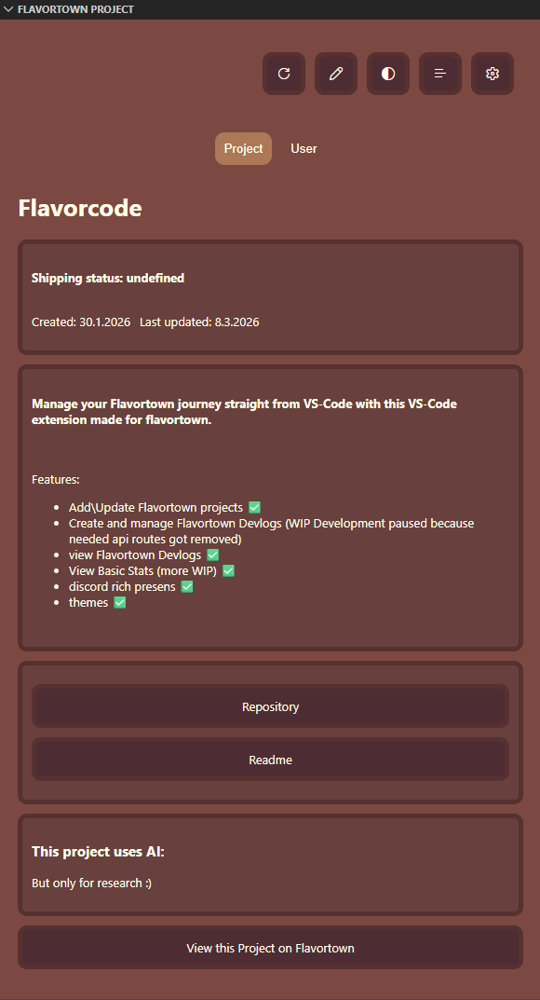
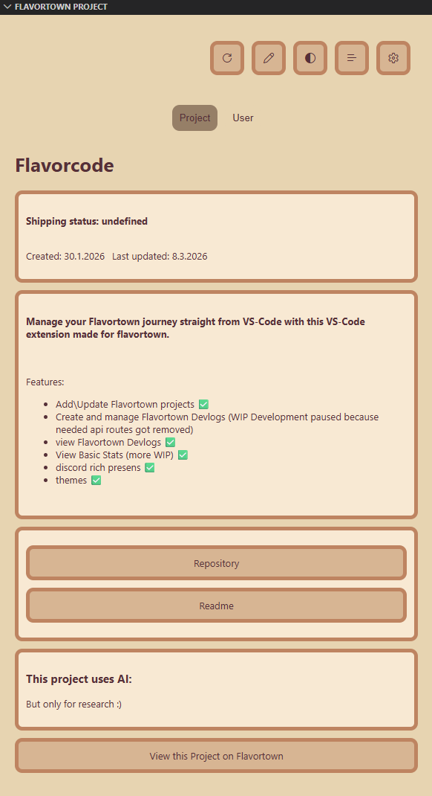
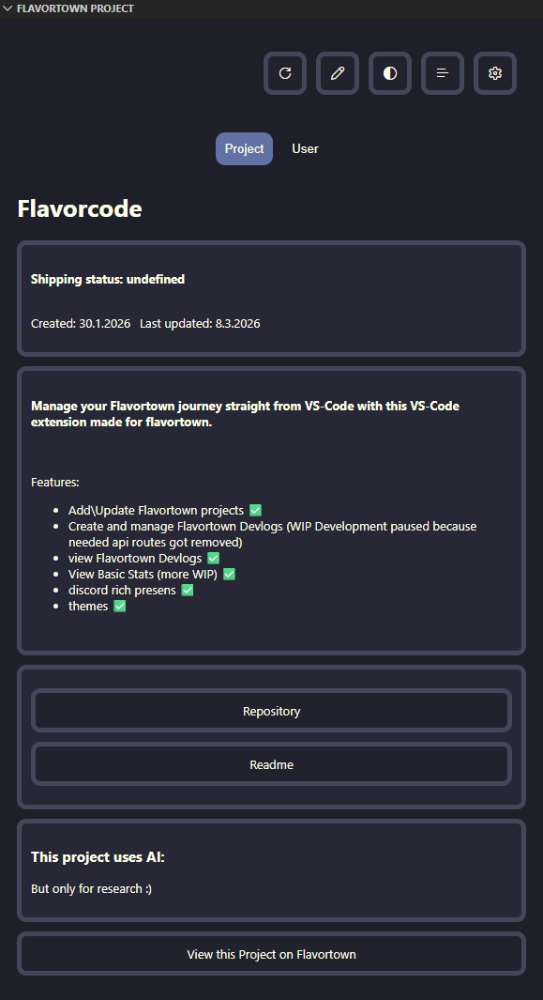
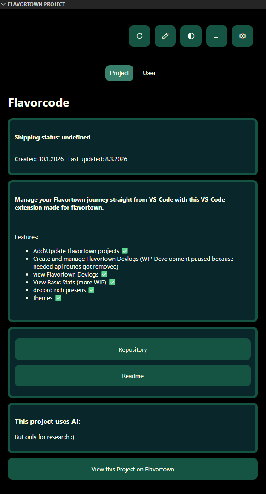

# flavorcode README

Flavorcode is a Flavortown VS-Code extension made by Joko26.
It currently only has limited features as many api routes crucial for this project were removed with out any announcement.
If those api routes get reintroduced this extension will regain full functionality.  

[Check it out on flavortown!](https://flavortown.hackclub.com/projects/11154)

## Table of contents

- [Setup](#setup)
- [Features](#features)
  - [View Project stats](#view-project-stats)
  - [View Devlogs](#view-devlogs)
  - [Create and update projects](#create-and-update-projects)
  - [Discord rich presence](#discord-rich-presence)
  - [Themes](#themes)
- [Requirements](#requirements)
- [Extension Settings](#extension-settings)
- [Release Notes](#release-notes)
- [Contribution guide](#contribution-guide)
- [Credits](#credits)

<!-- markdownlint-disable MD033 -->

## Setup

Set the extension up using the UI:

## Features

- ### View Project stats
  
  View stats for the project your currently working on!

  

- ### View User stats

  View your personal stats any time!

  

- ### View Devlogs

  View devlogs and devlog stats!

  

- ### Create and update projects

  Create and update projects.

  #### Creating

  

  #### Updating

  

- ### Discord rich presence

  share infos about the project your working on on discord:

  

- ### Themes

  Flavor code supports multiple different themes and color pallets:

  

  - #### Default

    This theme is based on the vscode theme you are currently using.

    

  - #### Dark

    This theme is based on the color sheme of the flavortown website.

    

  - #### Light

    This theme is a light version of the color sheme of the flavortown website.

    

  - #### Midnight

    This theme is inspired by the dark cozy vibe of the darkcula/drakcula color theme

    

  - #### Orosemo

    This theme is based on my own color pallete which ive also used in my [website](https://orosemo.de).

    

  <!-- markdownlint-enable MD033 -->

## Requirements

Add your Flavortown API key in the settings.

## Extension Settings

name|description|scope
---|---|---
flavortownApiKey|Set your flavortown api key to use this extension.|application
hackatimeApiKey|Set your hackatime api key to use this extension.|application
userId|Your Flavortown user Id used to get user info and projects.|application
projectId|Your Flavortown project id|workspace
useDiscord|Connect to discord rich Presence|application
theme|Set the theme of Flavorcode!|application

## Release Notes

### coming soon

## Contribution guide

This project is open for collaboration but please:

- use [Gitmojis](https://gitmoji.dev/) for your commit messages.
- document your changes in the this readme if neccesary

## Credits

- ### [SabioOfficial](https://github.com/SabioOfficial)

    Thanks for the great Markdown Parser. Definetly go check out [Spicetown](https://flavortown.hackclub.com/projects/140) ^_^
